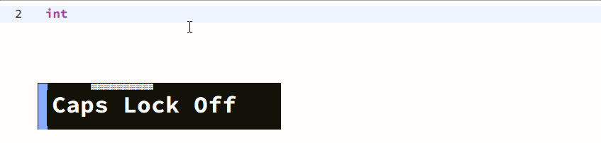

    
    <h1>Shift Saver</h1>
    

        
        
    

    
A VSCode extension reducing the use of shift key when naming.

By default, press <kbd>CapsLock</kbd> twice to enter shift-saving naming mode, and input any non-alphanum character or move cursor outside to exit.

