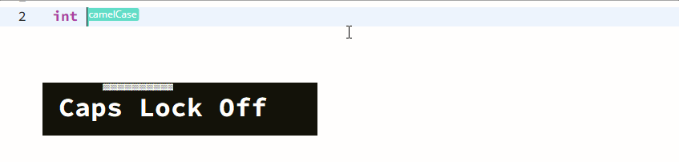

    
    <h1>Shift Saver</h1>
    

        
        
    

    
A VSCode extension reducing the use of shift key when naming.

By default, press <kbd>CapsLock</kbd> twice to enter shift-saving naming mode, and input any non-alphanum character or move cursor outside to exit.

    
Changelog

The format is based on [Keep a Changelog](https://keepachangelog.com/en/1.0.0/),
and this project adheres to [Semantic Versioning](https://semver.org/spec/v2.0.0.html).

## [Unreleased]

## [1.1.0] - 2021-01-22
### Added
- Configurable flag colors

### Changed
- Flags now get background/foreground colors based on current theme
- Flags are written with pure CSS instead of SVG

### Fixed
- Minor prettify border style for naming mode

## [1.0.1] - 2021-01-03
### Fixed
- Input left bracket will cause exiting naming mode
- Change project structure

## [1.0.0] - 2021-01-01
### Added
- Project logo and basic manual

## [0.0.2] - 2021-01-01
### Added
- Shift-saving naming mode
- Toggle between camelCase and underscore names

[Unreleased]: https://github.com/whoiscc/shift-saver/compare/v1.1.0...HEAD
[1.1.0]: https://github.com/whoiscc/shift-saver/compare/v1.0.1...v1.1.0
[1.0.1]: https://github.com/whoiscc/shift-saver/compare/v1.0.0...v1.0.1
[1.0.0]: https://github.com/whoiscc/shift-saver/compare/v0.0.2...v1.0.0
[0.0.2]: https://github.com/whoiscc/shift-saver/releases/tag/v0.0.2

